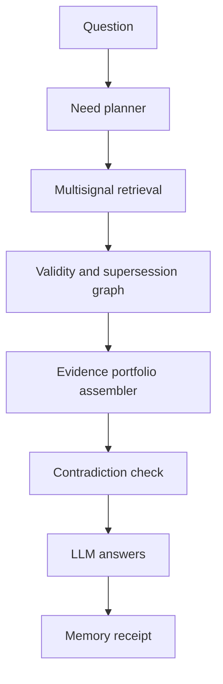

# Evidence portfolio — ideas (recorded, not scheduled)

Status: **proposal record only** (2026-09-22). No architecture change, no
experiment and no product work while the `admission-shadow-v2` window is
open. After the window closes, the three diagnostics (ranking miss,
admission discard, delivered-but-unused) decide which layer to invest in
first.

## The core shift

Memory retrieval today is a ranked list: score the memories, deliver the top
positions. P3v4 already showed the limit of that view in controlled settings:
**some evidence needs guaranteed space even when it does not have the highest
score** (the correction slot). The generalization:

> Stop asking only "which are the best memories?" and start asking "which
> **types of evidence** are needed to answer correctly?"

## 1. Evidence package with functional slots

Instead of filling the 4000-character budget with the highest-ranked items
alone, assemble a package with distinct slots:

| Slot | Function |
|---|---|
| Current state | latest valid information |
| Supersession | the correction that replaced an earlier fact |
| Origin | evidence proving where the information came from |
| History | a relevant earlier decision or event |
| Contradiction | evidence that disagrees with the probable answer |
| Related context | information from another branch that helps interpret |
| Reserve | best remaining candidate by the general ranking |

This generalizes P3v4's finding: **structural priority instead of score
alone**.

## 2. Memories as versioned claims

Represent a memory not only as text but as a claim:

```text
Claim: "The project uses the 4000-character limit"
State: current
Valid since: 2026-09-22
Origin: document X
Confidence: high
Supersedes: claim Y
May be superseded by: claim Z
```

The system would then distinguish: still true; true in the past; corrected;
an unconfirmed hypothesis; a personal preference that may change; a formal
decision that must not be re-inferred. This lowers the risk of surfacing an
old memory that is historically correct but wrong for the present.

## 3. Explicit contradiction registry

When two memories disagree, do not silently pick one. Create a conflict
object:

```text
Conflict:
- version A claims X
- version B claims Y
- B is more recent
- no explicit confirmation that B supersedes A
```

The model could then resolve via the supersession history, present the
uncertainty, ask the user, or preserve both until evidence appears. This is
especially valuable for personal memory, where preferences and circumstances
change.

## 4. Retrieval planner before search

Before searching, a small planner classifies the question's need: current
fact; historical evolution; prior decision; personal preference; comparison;
correction; combination of several facts; expected absence of memory. It then
decides which package slots must be filled. "Why did we choose this policy?"
needs history, decision and provenance; "what is the current threshold?"
needs current state and supersession. This avoids using the same search
strategy for every question.

## 5. Answer with a memory receipt

Internally, every answer can produce a receipt:

```text
Memories considered: 8
Memories admitted: 3
Current information used: M42
Correction considered: M37 -> M42
Open contradictions: 0
Budget used: 2,860/4,000 characters
```

The receipt need not always be shown to the user; it enables auditing,
debugging and scientific evaluation.

## Suggested architecture



## Priority (after the shadow window)

1. Typed evidence portfolio.
2. Versioned claims and supersession graph.
3. Contradiction registry.
4. Retrieval planner.
5. Audit receipt.

## Constraints

- Nothing here is implemented or scheduled; the current window freeze applies
  in full (no candidate, threshold, schema, retriever or default changes).
- Any of these proposals, when picked up, follows the house discipline:
  pre-registration, frozen fixtures, shadow-first evaluation, joint gates
  (availability **and** precision under the 4000-character budget), and a
  separate explicit decision for promotion.
- The three diagnostics from `admission-shadow-v2` are the selection signal
  for which layer goes first; ranking misses would point at layers 1-2
  (selection and validity), admission discards at layers 1/3, and
  delivered-but-unused at layer 5 (receipt/audit) and the answerer boundary.
